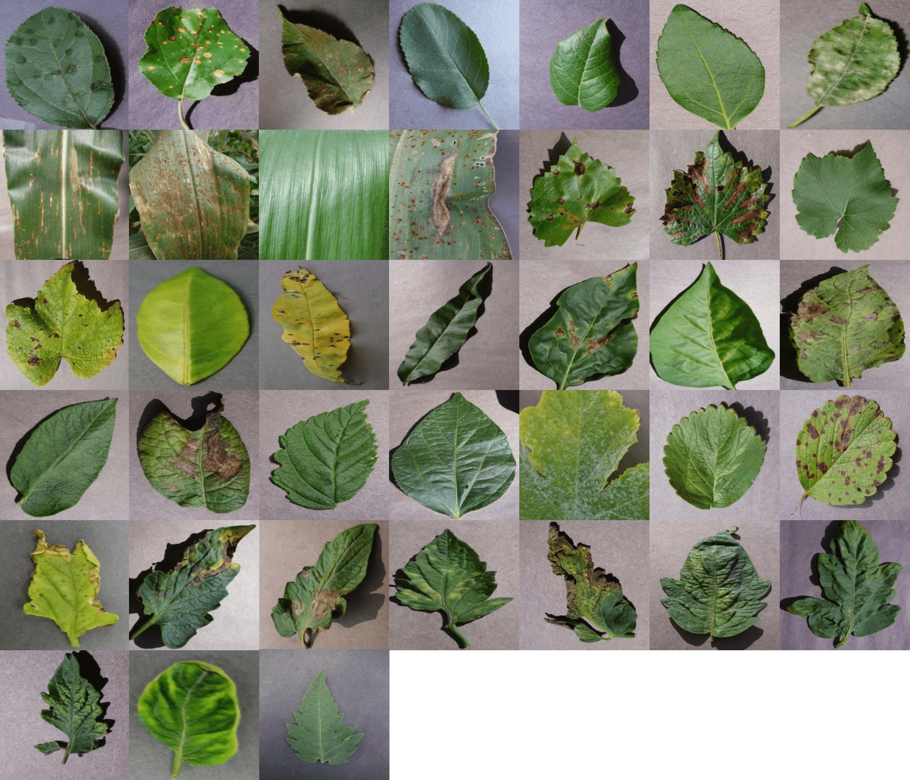
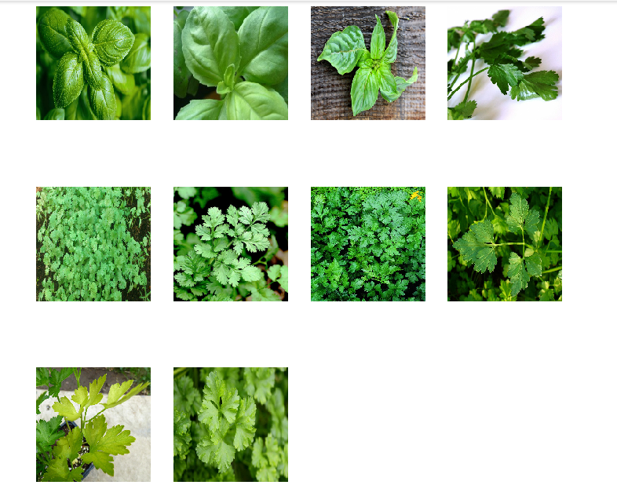
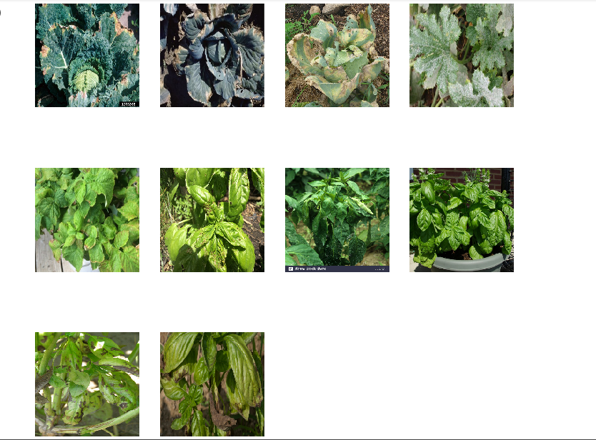
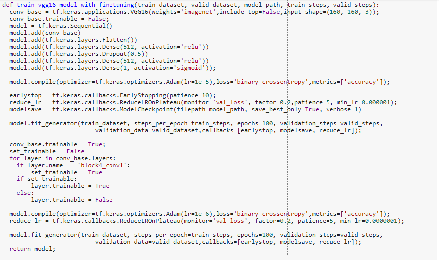
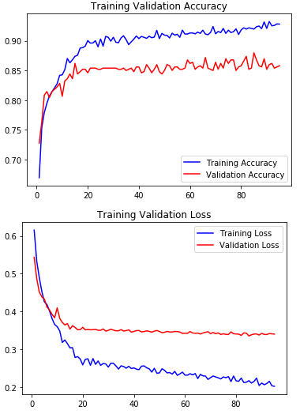
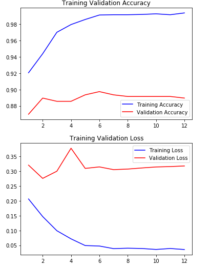
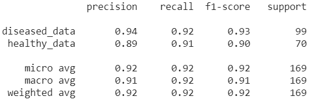

# Plant Classification in Healthy and Disease

----

## Problem Statement & Introduction

Human started Agriculture thousands years ago but no one know how old it is. It brings Neolithic Revolution, which cause people to leave nomadic hunting and became settlers which we know today cities. With the passage of time and to meet the demand of 7 billion people new ways are adapted in agriculture to have more foods. In modern days Vertical farming became more adaptive solution as compare to tradition farming to have more food in less lands. 

In door farming brings a revolution in tradition farming. Indoor farming is a method to grow crops or plants entirely indoor with controlled environment. Indoor farming use hydroponics and artificial lights to provide nutrients and lights for the growth of plants. A wide variety of plants can be grown indoors, but fruits, vegetables, and herbs are the most popular. Some of the most popular plants grown indoors are usually crop plants like lettuce, tomatoes, peppers, and herbs.

With the idea of indoor farming, the vertical farming used a controlled environment for growing crops. Some vertical farms use techniques similar to greenhouses, where natural sunlight can be augmented with artificial lighting and metal reflectors.

When growing indoors, many indoor farmers appreciate having more control over the environment than they do when they are using traditional farming methods. Light amounts, nutrition levels, and moisture levels can all be controlled by the farmer when they are growing crops solely indoors. They also need a system that monitor the health of a plant and generate alerts if a plant got a particular disease. The system need to be automatic which captures the real time images of plants at various angels and then classify it with either healthy or disease and provide a mitigation to reduce the disease effect.

## Solution

- To develop an automatic health check system, which regularly monitor the health of plants, we first need to develop a machine learning model that can distinguish between healthy and diseased plant. The model takes an input image and classify it and base on classification the system provides the mitigation to reduce the disease effect. 

- In our solution we developed a machine learning model in Tensorflow 2.0 using keras API which classify the plant image into either healthy or disease. The problem is a binary problem in which we have to classify an image either healthy (1) or diseased (0).

- To train a model we need dataset, keep this thing in mind we have gathered the data of different plants of both category healthy and disease. I would like to thanks Pam Loreto which provides the data of these categories. She has collected the data via internet and manually labelled them.

## Technicality

### Data exploration

The data consists of following plants:

-   Basil
-   Kale
-   Lettuce
-   Mint
-   Coriander
-   Parsley

There are total 3374 images in the data set in which 1943 images are of category diseased and 1431 images are of category healthy. The size of each image is different so the image dimension. Most of the images are in jpeg but also contains some images in .png and gif.

There is another dataset for plant disease classification [PlantVillage Disease Classification Challenge](https://www.crowdai.org/challenges/plantvillage-disease-classification-challenge). The main difference between PlantVillage and our dataset is that we have rich images unlike PlantVillage in which there are only images of leaves not whole plants. In real world it is very difficult and costly for the system to capture the images of each leaf separately and classify them into healthy and diseased.  

You can see some examples of both datasets. 

PlantVillage

Healthy Images in our dataset:

Diseased Images in our dataset:

### Data Cleaning and Prepration

We first clean the data so that it can be feed to a machine learning model. 

-   Dataset consists of RGB color images where each channel has value between 0-255, we first convert the each pixel value between 0 and 1. 
-   Each image is of different dimension so to have fix input dimension we convert the image into 160 x 160 dimension (please note we have tested difference dimensions like 150 x 150, 224 x 224 but got better results on 160 x 160).
-   We follow tutorial of [Load images with tf.data](https://www.tensorflow.org/alpha/tutorials/load_data/images#build_a_tfdatadataset), to create dataset API for feeding the data to neural network.
-   We created 3 datasets one for training, one for valid and one for testing. The data distribution is of 75%, 15% and 10% respectively.
-   For training data we use 64 batch size with shuffle and repeat, whereas for validation the batch size is of 32 and we didn't use shuffle and repeat because there is no need to shuffle the validation data, similarly for test dataset we use batch size of 1 without shuffle and repeat.
 

### Model Design and Training

We have tested different architecture of convolution neural network with different hyper parameters. We achieved best results on Vgg16 pre trained model with fine tuning on last two convolutional layers. Below is the architecture of our model

-   We use Vgg16 model, without top included, pre trained on imagenet followed by with two dense layers each having 512 units with Dropout of 50% between them.
-   Each dense layer has ‘relu’ activation function follow by 1 output dense layer with sigmoid activation function.
-   For loss we use binary_crossentropy and for optimizer we use Adam with learning rate 0.00001
-   For model callback we use early stop to save only best model which have lowest validation loss and Reduce learning rate if there is no variation in the validation loss.
-   The model was trained on train dataset and after each epoch the model is tested against validation dataset. 
-   Model only trained the parameter of last 2 dense layer and convolutional layer parameter was kept freeze.
-   Once model is trained we fine-tuned the model by setting last 2 convolutional layer trainable and retrained the model on training data. 
-   In fine tuning we used lower value of learning rate as compare to first training.

Below is the screenshot of code snippet of model design

We have also tested different architecture design with different parameters, some are mentioned below

-   Simple convolutional neural network with 3 Conv2D layer with 2 Dense layer.
-   A Separable convolution neural network with 4 SeparableConv2D follow by 2 Dense layer.
-   Pre trained version of Vgg16, Vgg19, Inception, Xception, MobileNet, DenseCNN and ResNet on imagenet dataset. We have seen that on DenseCNN and ResNet model perform very badly whereas on MobileNet, Inception and Xception we get fair accuracy. Vgg19 performed better than other models except Vgg16
-   Random initialization of weights of pre trained version of Vgg16, Vgg19, inception, Xception, mobileNet, DenseCNN and ResNet.We have seen on MobileNet the accuracy is much better as compare to other models. It could be because of overfitting.
-   We also use ImageDataGenerator API of keras for data augmentation but didn't see any significant difference in loss and accuracy.

### Validation and Test Loss/Accuracy

- We used 15% data for validation and 10% data for test. 
- During training we first set trainable = False of convolutional layers and only trained the dense layer. On this configuration we are able to achieve 0.332 loss and 87% accuracy on validation data. Please find below plot of both accuracy and loss of validation with respect to training data.

- Once model is trained on dense layers, we then fine-tuned the last 2 layers of convolutional and retrained the model with same training and validation data. On this configuration we are able to acheive 0.249 loss and 90% accuracy on validation data. Please find below plot of both accuracy and loss of validation with respect to training data.

- We saved the best model and tested the model on test dataset. On test dataset we are able to achieve 90% accuracy. Below is the screenshot of Precision, Recall and F1 score

## Code
- The work is developed using colab, you can review the notebook of the code both in ipynb and html format. Kindly look into notebook directory to get the ipynb and html file.
- The notebook provides step by step guide and explain each part of the code in simple English. To understand the code it is good you review the html format of notebook
- We also convert the ipynb to python script, you can find python code in script directory.

## Future Work
- Currently we just solve one problem in which we just classify the plant into diseased and healthy, the work can be extended to identify the disease type along with plant type. In this way the system could provide better suggestions for disease mitigation.

## Acknowledgement

- I would like to thanks Pam (pam@kula.ai) for providing the data. She has collected the data over internet.
- I would like to thanks Ammad Azam (ammadazam@gmail.com) for joining the team, cleaning the data (remove duplicate images etc) and helping in testing different model design.

## References
https://en.wikipedia.org/wiki/Agriculture#History
https://en.wikipedia.org/wiki/Vertical_farming
https://simple.wikipedia.org/wiki/Farming
https://www.maximumyield.com/definition/2151/indoor-farming

## For more information

Please feel free to contact me Waqas Ali on imwiqiali@gmail.com
